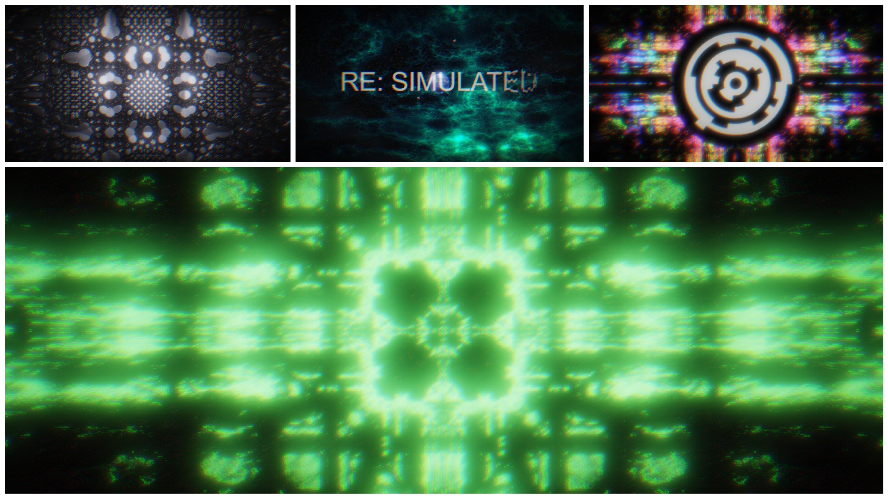

# RE: SIMULATED by gam0022 & sadakkey

RE: SIMULATED by [@gam0022](https://twitter.com/gam0022) (Graphics) & [@sadakkey](https://twitter.com/sadakkey) (Music)

A WebGL 64KB Intro

1st Place [PC 64K Intro](https://2020.revision-party.net/competitions/pc-competitions) at [Revision 2020](https://2020.revision-party.net/start)



## Run

Run in browser on your PC! (only tested latest Chrome)

- [64KB HTML version](https://gam0022.net/webgl/64k-intro_resimulated.html)
- [NEORT version](https://neort.io/art/bqa4pgs3p9f6qoqnmujg)

## Links

- [:tv: YouTube](https://youtu.be/tirAdWbceak)
- [:speech_balloon: Pouet](https://www.pouet.net/prod.php?which=85260)
- [:bird: Twitter](https://twitter.com/gam0022/status/1249658268319768576)

## Development

### 0: Required

- [node.js v12.14.1](https://nodejs.org/ja/) or higher
- [ruby 2.x](https://www.ruby-lang.org/ja/downloads/) or higher

### 1: Get Started

```sh
git clone git@github.com:gam0022/resimulated.git
cd resimulated

# init
npm install

# Start Web server with hot-reload / UI for debug
npm run start

# Generate a dist\resimulated.html
npm run build
```

## Chromatiq

A WebGL engine developed for PC 64K Intro aimed at minimizing the file size.

Written in a single TypeScript, but it's still in development. ([source code](https://github.com/gam0022/resimulated/blob/master/src/chromatiq.ts))

### Features

It has only simple functions so that it does not depend on the work.

- Rendering multi-pass image shaders (as viewport square)
- Build-in bloom post-effect
- Interface to animate uniforms from a TypeScript
- GLSL Sound (Shadertoy compatible)
- Play an Audio file (mp3 / ogg)

### How to Capture Movie

1. `npm run start`
2. misc/saveImageSequence
3. misc/saveSound
4. `ffmpeg.exe -r 60 -i chromatiq%04d.png -i chromatiq.wav -c:v libx264 -preset slow -profile:v high -coder 1 -pix_fmt yuv420p -movflags +faststart -g 30 -bf 2 -c:a aac -b:a 384k -profile:a aac_low -b:v 68M chromatiq_68M.mp4`

#### Links

- [アップロードする動画におすすめのエンコード設定](https://support.google.com/youtube/answer/1722171?hl=ja)
    - 映像ビットレート 2160p（4k）53～68 Mbps
- [YouTube recommended encoding settings on ffmpeg (+ libx264)](https://gist.github.com/mikoim/27e4e0dc64e384adbcb91ff10a2d3678)
- [超有益情報 by sasaki_0222](https://twitter.com/sasaki_0222/status/1248910333835530241)

## Thanks

- [FMS-Cat/until](https://github.com/FMS-Cat/until)
- [gasman/pnginator.rb](https://gist.github.com/gasman/2560551)
- [VEDA 2.4: GLSLで音楽を演奏できるようになったぞ！！！ - マルシテイア by amagitakayosi](https://blog.amagi.dev/entry/veda-sound)
- [[webgl2]example for webgl2 (with glsl3) by bellbind](https://gist.github.com/bellbind/8c98bb86cfd064d944312b09b98af1b9)
- [How to Convert an AudioBuffer to an Audio File with JavaScript by Russell Good](https://www.russellgood.com/how-to-convert-audiobuffer-to-audio-file/)
- [wgld.org by h_doxas](https://wgld.org/)

## License

[MIT](LICENSE)

## 🧠 DEV_README

### 🎯 **Project Overview**

RE: SIMULATED is a **64KB WebGL intro** that showcases the incredible potential of size-constrained digital art! 🎨 This project demonstrates advanced graphics programming techniques within the strict 64KB file size limit typical of demoscene competitions.

**Architecture Highlights:**
- 🎮 **Chromatiq Engine**: A custom WebGL2 engine optimized for minimal size
- 🎵 **GPU Sound Synthesis**: Audio generated entirely on the graphics card using GLSL shaders
- 🌟 **Multi-pass Rendering**: Sophisticated visual effects through layered shader passes
- 📱 **Cross-platform**: Runs in modern browsers with WebGL2 support
- ⚡ **Real-time**: 60fps procedural graphics with synchronized audio

The demo takes you on a journey through **fractal landscapes**, **cosmic scenes**, and **procedural universes** - all rendered in real-time with mathematical precision! 🚀

### 🧩 **Interesting Code Sections**

#### **🎨 Chromatiq Engine (`src/chromatiq.ts`)**
The heart of the demo! This custom WebGL engine is a masterclass in size optimization:
- **Dynamic method definition** in constructor to minimize `this` references (clever bundle size hack!)
- **Multi-pass rendering pipeline** with automatic bloom post-processing
- **Uniform management system** for smooth parameter animations
- **GPU texture-based audio synthesis** - audio rendered like a video frame!

#### **🔊 GPU Audio Magic (`src/shaders/sound-resimulated.glsl`)**
Mind-blowing technique where **audio is rendered as a texture**! Each pixel represents an audio sample:
- Uses **Shadertoy-compatible** sound shader format
- Procedural music generation with mathematical precision
- **67.9KB of pure GLSL audio synthesis** - larger than the entire rest of the codebase!

#### **📐 Mathematical Foundations (`src/math.ts`)**
Beautiful implementations of graphics programming essentials:
- **Fractional Brownian Motion** for organic noise
- **Easing functions** for smooth animations (cubic and cosine curves)
- **Vector3 class** optimized for 64KB constraints
- **Remapping utilities** for coordinate system transformations

#### **🖼️ Text Rendering System (`src/index.common.ts`)**
Ingenious **texture atlas generation** for all demo text:
- Dynamic canvas-based text rendering
- **4096px texture atlas** fitting 32 text entries
- Font rendering with **glow effects** and **custom styling**
- Includes planet names, credits, and technical terms!

### 📚 **Things to Research**

#### **🌐 Graphics Programming Concepts**
- 🔗 [Shadertoy](https://www.shadertoy.com/) - Learn fragment shader programming interactively
- 🔗 [Raymarching Techniques](https://iquilezles.org/articles/distfunctions/) - Essential for procedural 3D scenes
- 🔗 [WebGL2 Fundamentals](https://webgl2fundamentals.org/) - Modern OpenGL ES 3.0 in browsers
- 🔗 [Bloom Post-Processing](https://learnopengl.com/Advanced-Lighting/Bloom) - HDR glow effects

#### **🎼 Procedural Audio**
- 🔗 [GLSL Sound Tutorial](https://blog.amagi.dev/entry/veda-sound) - GPU-based audio synthesis
- 🔗 [WebAudio API](https://developer.mozilla.org/en-US/docs/Web/API/Web_Audio_API) - Browser audio processing
- 🔗 [WAVE File Format](https://docs.fileformat.com/audio/wav/) - Understanding audio file structure

#### **🏆 Demoscene Culture**
- 🔗 [Revision Party](https://revision-party.net/) - Premier demoscene event (where this won 1st place!)
- 🔗 [Pouet](https://www.pouet.net/) - Demoscene community and production database
- 🔗 [64KB Intro Category](https://en.wikipedia.org/wiki/64K_intro) - Size-constrained digital art

#### **⚙️ Build Tools & Optimization**
- 🔗 [Webpack Bundle Analysis](https://webpack.js.org/guides/code-splitting/) - Understanding build output
- 🔗 [TypeScript Compiler](https://www.typescriptlang.org/docs/) - Modern JavaScript with types
- 🔗 [Pnginator](https://gist.github.com/gasman/2560551) - HTML/JS size optimization tool

### 💡 **Developer Tips**

#### **🔧 Size Optimization Tricks**
- **Avoid TypeScript enums** - they generate extra code! Use `const` objects instead
- **Define methods in constructor** to reduce `this` keyword usage (saves bytes!)
- **Use raw-loader for shaders** to inline GLSL code directly
- **Minimize uniform names** in shaders - every character counts
- **Leverage webpack DefinePlugin** for conditional compilation

#### **🎮 Development Workflow**
- Use `npm run start` for **hot-reload development** with dat.GUI controls
- Toggle `debugFrameNumber` to **isolate specific rendering passes**
- Adjust resolution scaling for **performance testing** on different hardware
- Use **preserveDrawingBuffer** for taking screenshots/recordings

#### **🎨 Shader Development**
- **Start simple** - build complexity gradually
- **Test on mobile** - mobile GPUs have different limitations
- **Use texture atlases** for multiple images (saves draw calls)
- **Profile with browser dev tools** - identify bottlenecks early

#### **🔊 Audio Considerations**
- **GPU audio is experimental** - have fallback plans
- **Test across browsers** - WebAudio support varies
- **Consider latency** - GPU audio generation has inherent delays
- **Monitor texture size** - large audio textures consume VRAM

### 🛠️ **Tooling Overview**

#### **📦 Build System**
- **Webpack 4** - Module bundling and optimization
- **TypeScript 3.7** - Modern JavaScript with type safety  
- **Raw Loader** - Inline GLSL shaders as strings
- **Clean CSS** - CSS minification for production builds

#### **🎯 Development Tools**
- **dat.GUI** - Real-time parameter tweaking interface
- **Three.js OrbitControls** - Debug camera manipulation
- **File-saver** - Export functionality for screenshots/audio
- **Webpack Dev Server** - Hot reloading and live development

#### **🚀 Production Pipeline**
- **Multiple build targets**: Development, Production, NEORT platform
- **Environment-specific optimization** via DefinePlugin
- **Ruby pnginator** - Final HTML embedding and compression
- **Legacy OpenSSL support** - Compatibility with newer Node.js versions

#### **🌍 Platform Support**
- **WebGL2 required** - Uses advanced GPU features
- **Modern browsers** - Chrome 56+, Firefox 51+
- **Float texture support** - Essential for HDR rendering
- **WebAudio context** - Required for sound playback

---

**🎉 Ready to dive into the code? Start with `src/math.ts` for fundamentals, then explore `src/chromatiq.ts` for the rendering engine magic! The shader files in `src/shaders/` contain the visual artistry that makes this demo shine! ⭐**